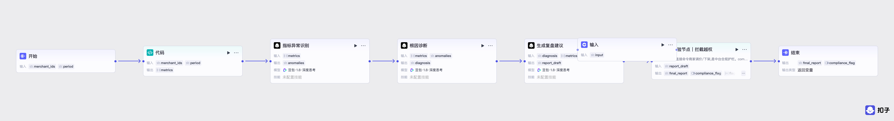

# 团购复盘诊断 Agent

> 面向抖音生活服务运营团队的 AI 中台能力 —— 用 Agent + Workflow 双层架构，将商家团购复盘效率从"人工拉数据写报告"升级为"AI 诊断 + 运营把关"。

---

## 项目背景

抖音生活服务平台上大量商家上线团购后，运营需要每周批量复盘几十家商家的经营表现——拉曝光、核销、退款、差评等一堆数据，写复盘结论，再同步给商家。这个流程**重复性高、数据维度多、对分析能力要求不低**。

本项目定位是 **AI 中台能力**，但不直接面向商家，而是**先服务内部运营**：

```
AI 中台（诊断分析）→ 运营（二次校验）→ 商家（沟通话术）
```

这么设计的原因：
- 很多商家看不懂平台指标，直接给 AI 结果门槛太高
- AI 的经营建议不能直接当最终决策（尤其调价/下架），中间必须有运营把关
- 中台先赋能内部角色，再流转到商家，是更稳的落地方式

---

## 架构设计：Agent + Workflow 双层

选型逻辑：**路径确定的交给 Workflow，路径开放的交给 Agent。**

```
┌─────────────────────────────────────────────────┐
│          交互式诊断 Agent（Botflow）              │
│  运营提问 → 判断信息是否充分 → 追问/调用Workflow   │
│  输出：【运营内部分析】+【商家沟通话术】            │
├─────────────────────────────────────────────────┤
│          批量复盘 Workflow                        │
│  商家ID + 周期 → 拉指标 → 异常识别 → 根因诊断     │
│  → 合规校验 → 结构化报告                          │
└─────────────────────────────────────────────────┘
```

| 层级 | 形式 | 适用场景 | 特点 |
|------|------|---------|------|
| **底层 Workflow** | 批量、无对话 | 每周定期批量复盘几十家商家 | 入参完备、流程固定、输出统一、稳定可控 |
| **上层 Agent** | 交互式、多轮对话 | 运营针对某一家店深度追问 | 信息不足主动追问、动态决定是否调用 Workflow、灵活归因 |

**为什么不只用 Workflow？** 运营做深度排查时，会追加条件、多轮追问、中途改前提（如"商家不愿降价，给个不降价的方案"），这种路径是开放的，固定 Workflow 覆盖不了。

**为什么不只用 Agent？** 批量周报入参完备、流程固定，用 Workflow 效率更高、更可控，不需要 Agent 的推理开销。

### Workflow 节点链路

```
开始 → 代码 → 指标异常识别 → 根因诊断 → 生成复盘建议 → 校验节点 → 结束
```

| 节点 | 输入 | 输出 | 说明 |
|------|------|------|------|
| **开始** | `merchant_ids`, `period` | — | 商家 ID 列表 + 统计周期 |
| **代码** | `merchant_ids`, `period` | `metrics` | 拉取团购指标（曝光、进店、核销、退款、差评、商圈对标） |
| **指标异常识别** | `metrics` | `anomalies` | 识别偏离商圈均值或历史趋势的异常指标（模型：豆包·1.8·深度思考） |
| **根因诊断** | `metrics`, `anomalies` | `diagnosis` | 四类根因归类：流量/转化/商品/服务品控（模型：豆包·1.8·深度思考） |
| **生成复盘建议** | `diagnosis`, `metrics` | `report_draft` | 基于诊断结果生成结构化复盘报告（模型：豆包·1.8·深度思考） |
| **校验节点** | `report_draft` | `final_report`, `compliance_flag` | 合规护栏：拦截越权建议（直接命令商家调价/下架），输出合规标记 |
| **结束** | — | `final_report`, `compliance_flag` | 返回最终报告 + 合规状态 |



---

## 核心能力

### 1. 智能诊断

- **四类根因诊断**：流量问题 / 转化问题 / 商品问题 / 服务品控问题
- **信息缺口声明**：信息不足时不硬编结论，而是明确指出"需验证哪些要素才能精准定位"
- **按需调用**：简单问题直接归因单个指标，复杂问题调用完整 Workflow 生成全量复盘

### 2. 双输出结构

| 输出块 | 受众 | 风格 |
|--------|------|------|
| 【运营内部分析】 | 运营 | 专业直接，含数据引用、根因判断、指标对比 |
| 【可转发给商家的沟通话术】 | 商家 | 友好、只讲方向，不含内部指标细节 |

运营不用自己改写，避免复制粘贴带来的误解。

### 3. 合规护栏（V1 → V2 → V3 迭代）

AI 给的经营建议不能越权替商家做决策，合规护栏确保输出措辞合规：

| 版本 | 方案 | 效果 | 局限 |
|------|------|------|------|
| **V1** | 固定词表拦截（`立即降价`、`马上下架`） | 能拦明显越权 | 模型换说法（`立即将套餐价调整`）就绕过 |
| **V2** | 强制信号词下沉替换（`立即`→`可评估`，`马上`→`建议`） | 大部分强制语气被成功替换 | 复杂句式替换后可能生硬 |
| **V3**（已设计） | LLM 语义审查节点，判断"是否在替商家下强制决策"，支持整句重写 | 理解语义，不依赖关键词匹配 | 待部署 |

**V2 信号词替换规则：**

| 拦截词 | 替换为 |
|--------|--------|
| 立即 | 可评估 |
| 马上 | 建议 |
| 必须 | 建议 |
| 务必 | 建议 |
| 直接下架 | 评估套餐去留 |
| 强制 | 建议 |

**V3 架构定位：** V2 做前置快拦（成本低、速度快），V3 做后置审查（兜住语义级越权），双层互补。

### 4. Prompt Engineering

4 条行为约束规则，每条对应一类要防的问题：

| 规则 | 防的问题 | 具体做法 |
|------|---------|---------|
| **信息不足先追问** | 防止硬编结论 | 缺关键信息时先问"近期是否改过价、换过套餐图" |
| **双输出** | 防止运营自行改写产生误解 | 强制分"内部分析"和"商家话术"两块 |
| **合规措辞** | 防止越权指令 | 禁止"立即降价""马上下架"，调价下架类标注"需确认" |
| **反幻觉** | 防止编造数据 | 优惠/指标只引用真实数据，信息不足声明缺口 |

---

## 评测体系

### 为什么分两套

Workflow 测"单次输入到输出对不对"；Agent 多了对话维度（该不该追问、工具调用是否合理、多轮是否跟随约束），纯 Workflow 评测覆盖不到。

### 数据集构造

**按失败模式反向构造对抗集**，不是随机采样：

1. 列出场景最怕的几类错：AI 乱建议调价、乱下架、幻觉编数据、漏掉关键问题
2. 每类专门造 case 去钓
3. 每条手标预期结论和红线

### 评测指标

| 维度 | Workflow | Agent |
|------|----------|-------|
| 归因准确率 | ✅ | ✅ |
| 业务合规率（权重最高） | ✅ | ✅ |
| 报告完整度 | ✅ | ✅ |
| 幻觉率 | ✅ | ✅ |
| 工具调用合理性 | — | ✅ |
| 多轮上下文跟随 | — | ✅ |

### 评测驱动迭代

合规护栏的 V1→V2→V3 就是评测驱动的：V1 对抗测试发现漏拦 → 定位到"固定词组"粒度太粗 → V2 下沉到信号词 → 再测发现复杂句式问题 → 设计 V3 语义审查。

---

## 技术栈

| 组件 | 技术选型 |
|------|---------|
| 平台侧 | 扣子（Coze）Workflow + Botflow |
| 本地 Agent | LangChain + LangGraph |
| 大模型 | doubao-seed-2-0-lite-260215 |
| 工具调用 | HTTP OpenAPI 调用扣子平台 Workflow |
| 短期记忆 | 滑动窗口（保留最近 20 轮 / 40 条消息）+ Checkpointer |
| 错误处理 | 中间件模式，工具异常不阻塞 Agent 循环 |

---

## 项目结构

```
.
├── config/
│   └── agent_llm_config.json          # 模型配置 + 系统提示词
├── src/
│   ├── agents/
│   │   └── agent.py                   # Agent 核心逻辑（build_agent）
│   ├── tools/
│   │   └── groupbuy_review_tool.py    # 团购复盘工具（调用扣子 Workflow API）
│   ├── storage/
│   │   └── memory/
│   │       └── memory_saver.py        # 短期记忆 Checkpointer
│   └── main.py                        # 运行入口
├── CHANGELOG.md                       # 完整迭代记录（平台侧 + 代码侧）
├── pyproject.toml                     # 依赖声明
└── README.md
```

---

## 运行方式

### 本地运行

```bash
# 启动 Agent 流程
bash scripts/local_run.sh -m flow

# 启动 HTTP 服务
bash scripts/http_run.sh -m http -p 5000
```

### 对话示例

```
运营：帮我看看商家 12345 最近的团购核销率怎么样

Agent 输出：
【运营内部分析】
1. 烧烤店A核心问题聚焦转化与品控双短板：核销转化率 5.6% 显著低于商圈平均...
2. 火锅店B存在数据维度缺失：曝光量 8000 与商圈平均的对比未明确...

【可转发给商家的沟通话术】
致烧烤店A商家：
- 套餐吸引力提升：您的套餐定价略高于商圈均价，可考虑适当调整...
- 服务体验优化：部分用户反馈"上菜慢"，建议优化后厨备餐流程...
```

---

## 迭代历程

完整迭代记录见 [CHANGELOG.md](./CHANGELOG.md)，包含：

- **平台侧 6 个版本**：Workflow 初版 → 合规护栏 V1/V2/V3 → Botflow Agent
- **代码侧 2 个版本**：本地 Agent 集成 → 工具健壮性增强

关键迭代节点：
1. 合规护栏 V1 对抗测试发现漏拦 → 驱动 V2 信号词下沉
2. V2 复杂句式生硬 → 驱动 V3 LLM 语义审查设计
3. Agent 信息不足时主动声明缺口，不硬编结论

---

## 设计决策记录

| 决策 | 选择 | 原因 |
|------|------|------|
| Agent vs Workflow | 双层结合 | 批量固定→Workflow，交互开放→Agent |
| 先服务运营而非商家 | AI→运营→商家 | 商家看不懂指标 + AI 建议不能直接当决策 |
| 合规护栏方案 | V2 快拦 + V3 精审 | 规则式成本低速度快，LLM 式理解语义兜底 |
| 评测数据集构造 | 按失败模式反向构造 | 随机采样全是 happy path，钓不出问题 |
| 模型选择 | doubao-seed-2-0-lite | 均衡型模型，兼顾效果与成本 |
